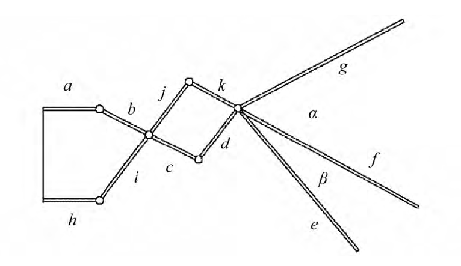
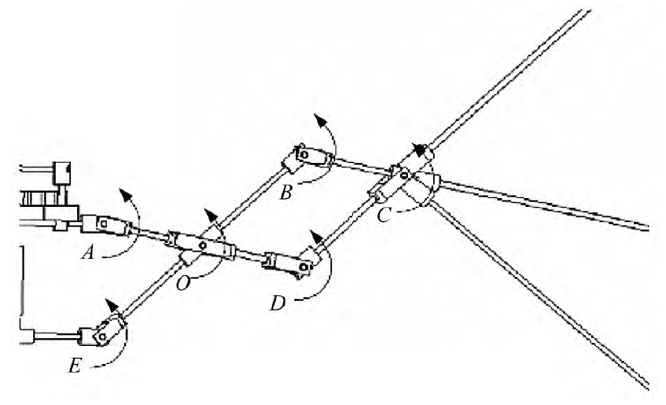
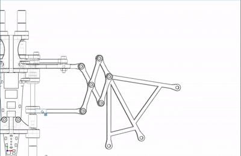
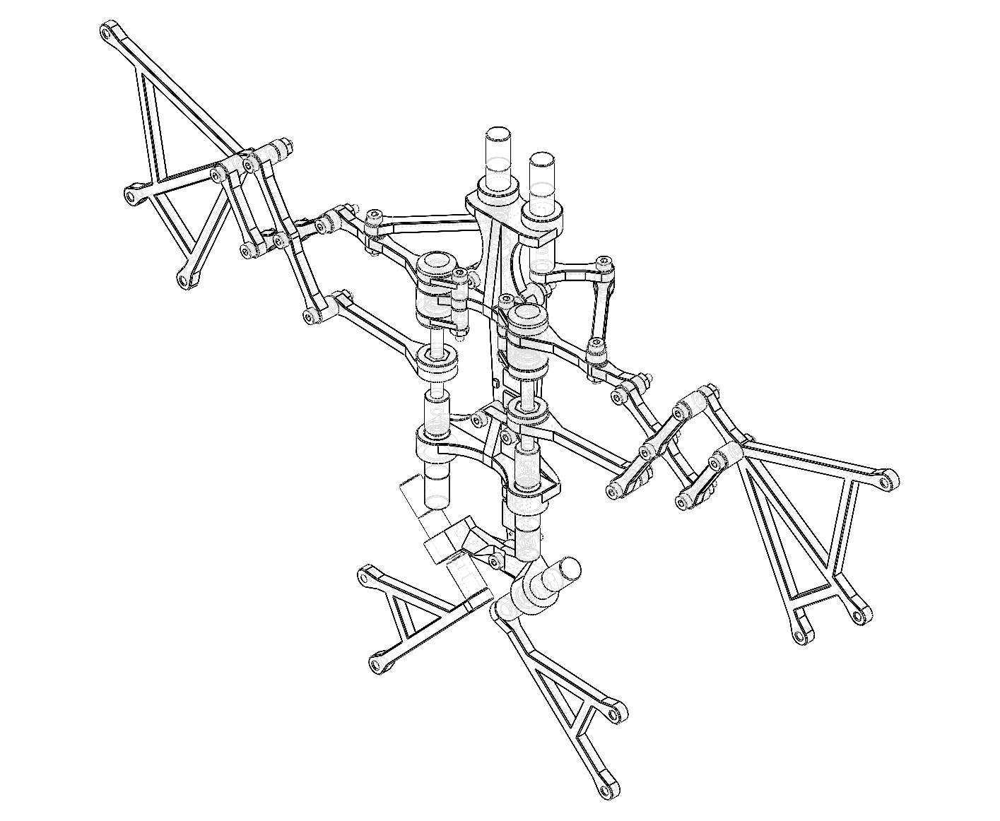
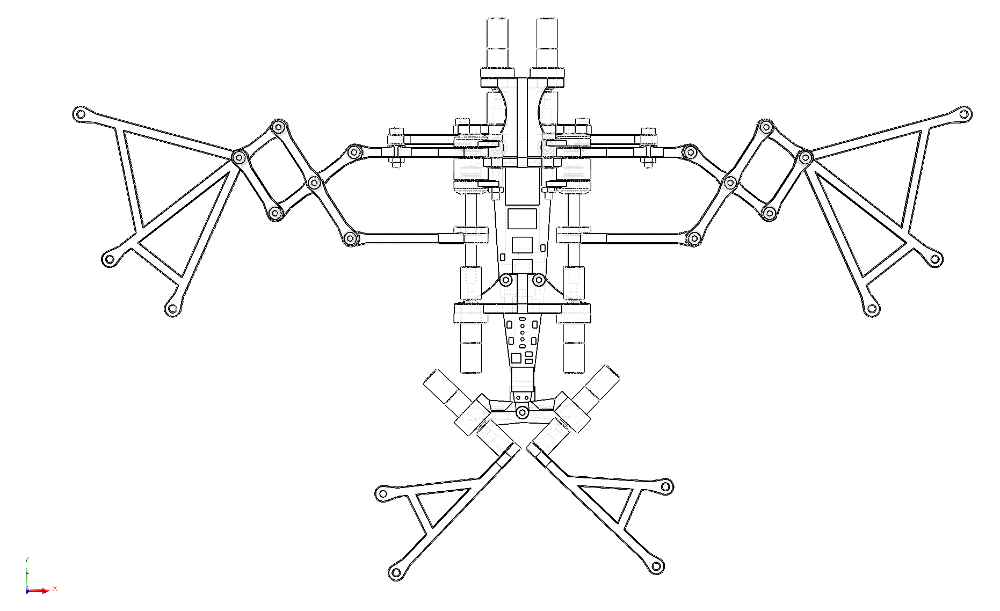
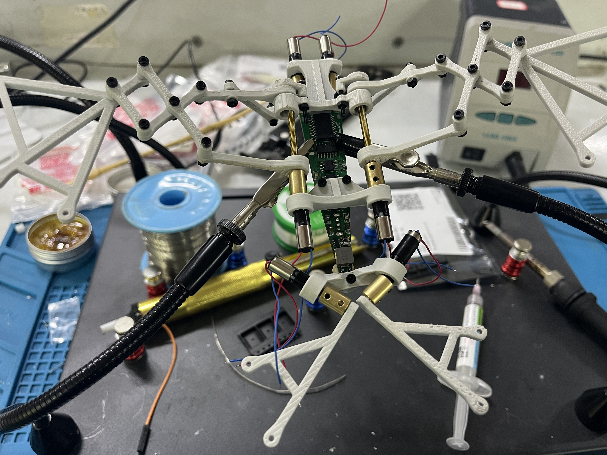
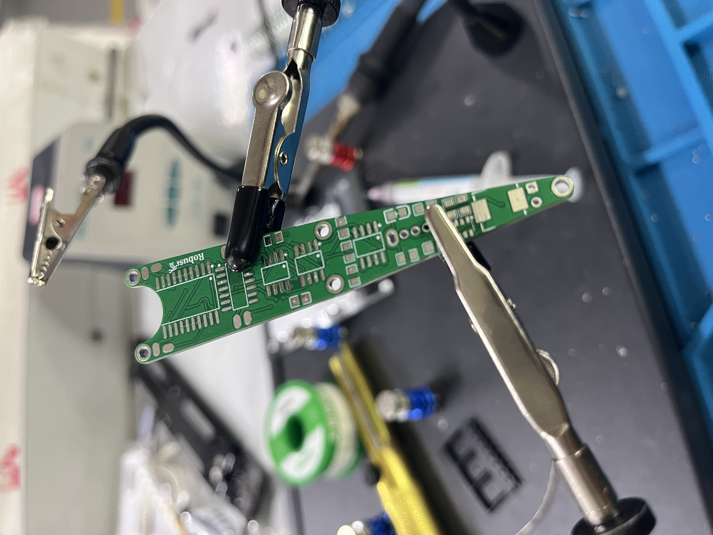
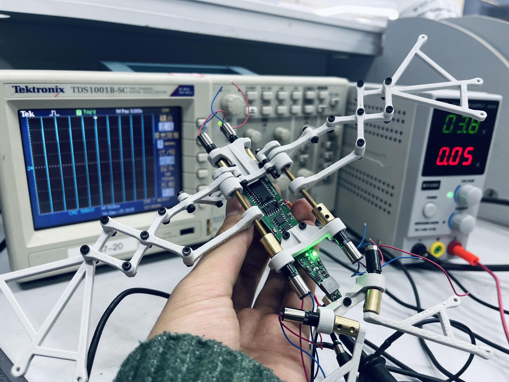

<p align="center">
  
</p>

<h1 align="center">Hsiwu</h1>

<p align="center">
  <strong>无MCU纯模拟电路仿生蝙蝠扑翼机器人</strong>
  <br>
  三段独立驱动翅膀 · 纯模拟控制
</p>

<p align="center">
  <a href="./LICENSE.md"></a>
  
  
  
  
  <br>
  <a href="./README.zh-CN.md">中文版本</a> | <a href="./README.md">English</a>
</p>

---

<a id="中文版本"></a>

## 名称由来

<p align="center">
  
  <br>
  <em><strong>Hsi Wu</strong>（西木），<strong>《成龙历险记》</strong>中的天之恶魔。</em>
</p>

本项目名称 **Hsiwu** 来源于《成龙历险记》中的蝙蝠形态**天之恶魔**——**Hsi Wu**（西木）。恰如其名：正如西木以分段变形之翼主宰天空，Hsiwu 机器人亦复现了真实蝙蝠的分段翼膜扑动。

---

## 项目简介

**Hsiwu**——以蝙蝠形态天之恶魔命名——是一款仿生蝙蝠扑翼机器人。与传统单段刚性机翼无人机不同，它复现了真实蝙蝠飞行中分段式翼膜变形的运动模式。每侧翅膀分为三个独立驱动的段落——**前缘段**、**中段**和**后缘段**——各自由独立的直流电机驱动。

仿生设计以*中华鼠耳蝠*（*Rhinolophus luctus*）为形态学参考。通过曲柄摇杆四连杆机构，将各直流电机的连续旋转运动转化为驱动翅膀段落的往复摆动，忠实再现了真实蝙蝠翼膜的耦合扑动-伸展运动学特性。

本项目的一个标志性特征是**纯模拟控制架构**。系统不使用任何微控制器（MCU），也不包含任何嵌入式软件。取而代之的是完全依赖分立模拟与数字逻辑电路——**NE555**定时器、**74HC04**反相器和**L293D** H桥驱动芯片——来产生驱动翅膀所需的同步周期性往复运动。

项目涵盖了完整的工程栈：模拟电子设计、数字逻辑、定制PCB布局、机械结构建模（SolidWorks）、FDM 3D打印以及硬件组装与调试。

> **参考文献**：气动与机械原理参考自《仿生蝙蝠飞行器的设计制造》（齐津浩，张卫平，2020），发表于《机械设计与研究》第36卷第5期。该参考样机翼展205 mm，整机质量17.81 g，扑动角度70°，扑动频率约10 Hz，在3.7 V供电下可产生约0.16 N的升力。

<p align="center">
  
  <br>
  <em><strong>图0 — 项目概览。</strong>Hsiwu 完整装配体的全彩三维渲染图。可见双侧对称框架底盘（中央支撑、头部支撑、尾部支架）、六段独立驱动翅膀（每侧三段——前缘、中段、后缘）、连杆、丝杠驱动剪式伸缩机构以及定制异形PCB。此渲染图对应于 <code>final_assembly.SLDASM</code> 中定义的最终装配状态。</em>
</p>

---

## 核心特性

- **仿生翅膀运动学** — 每侧翅膀三段独立驱动（前缘、中段、后缘），各段配备独立直流电机，模拟真实蝙蝠翼膜的伸展与弯曲。曲柄摇杆四连杆机构将电机连续旋转转化为往复扑动。
- **零MCU / 零代码** — 纯模拟控制：NE555多谐振荡器产生时序，74HC04六反相器进行相位分离，L293D双H桥实现双向电机驱动。无微控制器、无固件、无需编程。
- **定制异形PCB** — 在EasyEDA（LCEDA）和Altium Designer中设计的专用异形PCB，轮廓贴合内部机械框架。将电源管理、信号发生和电机驱动集成于单块紧凑电路板上。
- **模块化机械设计** — SolidWorks全参数化三维模型。框架部件可FDM 3D打印，采用标准M2/M3螺丝和铰链连杆组装，便于调校和维修。
- **集成电源管理** — 单节3.7V锂电池输入，MT3608升压转换器（3.7V → 7.35V供电机），板载LDO稳压（5V供逻辑电路），防反接保护，带指示灯电源开关。

---

## 系统架构

### 1. 电子系统（`/electronics`）

核心逻辑分布在集成于单块定制PCB上的五个功能模块中：

<p align="center">
  
  <br>
  <em><strong>图1 — 完整系统原理图。</strong>包含四个功能模块的完整电路图：（左）MT3608升压转换器，带肖特基二极管防反接保护和电源开关；（中上）三路NE555多谐振荡器级，各自产生独立的~4.8 Hz方波时序信号；（右）74HC04六反相器，用于产生互补相位信号；（下）三片L293D双H桥驱动芯片，每片使用一个半桥通道驱动一个电机，实现连续正反转往复运动。</em>
</p>

| 模块 | 核心器件 | 功能 |
|-------|-----------|----------|
| **电源供应** | MT3608、LDO、肖特基二极管 | 3.7V锂电 → 7.35V（升压，供电机）+ 5V（LDO，供逻辑）。防反接保护，带指示灯电源开关。 |
| **时序发生** | 3× NE555（多谐振荡模式） | 三路独立同步方波振荡器，频率约4.8 Hz。设定扑翼频率。每路NE555的RC网络可独立调校，实现分段时序微调。 |
| **相位反相** | 1× 74HC04 六反相器 | 将三路NE555输出反相，为H桥方向控制提供互补逻辑电平。每路NE555输出驱动一个反相器通道，产生对应半桥的反向信号。 |
| **电机驱动** | 3× L293D 双H桥 | 每片L293D使用一个半桥通道驱动一个电机。互补逻辑信号产生连续正反转往复运动。内置续流二极管防止感性反冲。 |
| **PCB布局** | 定制异形轮廓 | 垂直模块化布局；板外形贴合内部机械框架。异形板轮廓匹配中央支撑底盘的曲率。 |

<p align="center">
  
  
  <br>
  <em><strong>图2a–2b — PCB设计视图（一）。</strong>左：三维渲染图，展示定制异形PCB上的元件布局——三片NE555（SOP-20封装，U1–U3）、74HC04（SOIC-14，U5）、三片L293D（SOIC-8封装等效，U6–U8）、MT3608（SOT-23-6，U4）、SMC肖特基二极管（D1）、SMD功率电感（L1）、XH-2A连接器（U9）、0805无源元件（R1–R11、C1–C8）以及滑动开关（SW2）。右：顶层铜皮布线及丝印覆盖层。</em>
</p>

<p align="center">
  
  
  
  <br>
  <em><strong>图2c–2e — PCB设计视图（二）。</strong>从左至右：底层铜皮及丝印层；顶层裸铜走线（去填充）；底层裸铜走线（去填充）。Gerber制板文件位于 <code>electronics/output/gerber/</code>。</em>
</p>

### 2. 机械结构（`/mechanical`）

机械装配体在SolidWorks中设计（`.SLDPRT` / `.SLDASM`源文件），通过FDM 3D打印制造。运动学原理参考自《仿生蝙蝠飞行器的设计制造》（齐津浩、张卫平，2020）。

#### 2.1 运动学机构（参考文献）

以下运动学示意图引自参考文献，展示了构成翅膀传动系统的四个核心机构：

<p align="center">
  
  
  <br>
  <em><strong>图3a–3b — 曲柄摇杆四连杆机构。</strong>左：将电机轴连续旋转运动转化为摇杆上下往复摆动的曲柄摇杆机构运动学简图。曲柄（由减速空心杯直流电机驱动）连续旋转；连杆将运动传递给摇杆，摇杆输出角度决定了翅膀段落的扑动幅度（参考设计约70°）。右：带参数表的尺寸化连杆图纸——关键连杆长度a/b/c/d/e/f/g/h/i/j/k以及曲柄/摇杆枢轴角度α/β均按目标75°扑动行程标注。参考样机采用针对205 mm翼展优化的连杆比例。</em>
</p>

<p align="center">
  
  
  <br>
  <em><strong>图3c–3d — 剪式伸缩与腿部传动机构。</strong>左：由丝杠（螺距P = 0.4 mm，有效直径d₂ = 1.74 mm）控制的剪式机构。电机驱动丝杠使移动螺母前进/后退，推动/拉动剪式连杆以控制翼膜伸缩。参考文献计算出丝杠驱动力矩M = 0.0064 N·mm。右：腿部/传动机构，展示电机到连杆的耦合几何关系，通过静力平衡分析求解枢轴点O–O′及反力F<sub>A</sub>、F<sub>B</sub>。整体机械优势设计为在3.7 V供电下产生约0.16 N升力。</em>
</p>

#### 2.2 本项目机械装配体

本项目的机械装配体由以下子装配体组成（全部SolidWorks源文件位于 `mechanical/source/`）：

| 子装配体 | 路径 | 关键零件 | 说明 |
|-------------|------|-----------|------|
| **结构框架** | `structural/` | `central_support`、`head_support`、`tail_bracket` | 左右对称底盘；中央支撑构成主体，头部/尾部支架锚定翅膀枢轴点 |
| **连杆** | `rods/` | `rod_a`、`rod_bc`、`rod_d`、`rod_h`、`rod_ij`、`rod_kf` | 六种连杆类型，构成各翅膀段落的曲柄摇杆四连杆运动链 |
| **电机与联轴器** | `motor/` | `four-stage_geared_hollow_cup_motor`、`2-to-3_coupling` | 空心杯直流电机，四级行星齿轮减速；2转3轴联轴器连接丝杠 |
| **丝杠总成** | `structural/` | `lead_screw`、`head_drive_shaft`、`bearing`、`center_bearing_cap`、`head_bearing_cover` | 丝杠（P = 0.4 mm）驱动剪式伸缩连杆；两端由微型轴承支撑 |
| **枢轴硬件** | `structural/` | `head_pin`、`tail_pin` | 前缘和后缘枢轴点处翅膀段落铰接的精密铰链销 |
| **紧固件** | `fasteners/` | `SCA_M2_L10/L12/L14/L18`、`SLMNA-M2`、`SLMNA-M3` | M2沉头螺丝（10–18 mm长度），M2/M3防松螺母用于框架装配 |
| **总装配体** | `assembly/` | `final_assembly.SLDASM` | 引用所有子零部件在其装配位置的主装配体文件 |

<p align="center">
  
  <br>
  <em><strong>图4 — 丝杠传动动画。</strong>丝杠驱动剪式机构的动态演示。电机旋转丝杠时，移动螺母线性前进，推动剪式连杆张开以扩展翼膜面积——或收缩以减小面积。这种耦合的伸缩/扑动运动是复现蝙蝠翅膀变弯度空气动力学特性的关键仿生特征。</em>
</p>

<p align="center">
  
  
  <br>
  <em><strong>图5a–5b — 机械图纸。</strong>左：俯视图——展示电机布局、连杆布线及整体翼展几何。右：等轴测线框图——线描渲染，展示完整的运动学骨架，所有连杆枢轴点、杆件连接和结构框架构件在同一透视图中可见。前视图见项目顶部横幅。</em>
</p>

---

## 仓库结构

```
HSIWU/
├── electronics/                 # PCB设计文件
│   ├── source/                  #   LCEDA工程（.eprj2）+ Altium Designer源文件（.schdoc, .pcbdoc）
│   └── output/                  #   Gerber文件、BOM、贴片坐标（.csv/.xlsx）、PDF原理图
├── mechanical/                  # 3D CAD模型（SolidWorks）
│   ├── source/                  #   原生SLDPRT/SLDASM文件
│   │   ├── structural/          #     框架、丝杠、轴承、销钉、支架
│   │   ├── rods/                #     六种连杆类型（a, bc, d, h, ij, kf）
│   │   ├── motor/               #     减速空心杯电机+轴联轴器
│   │   ├── fasteners/           #     M2/M3螺丝及防松螺母
│   │   ├── pcb_3d_models/       #     含全部元件3D模型的PCB装配体
│   │   └── assembly/            #     总装配体文件
│   └── output/                  #   导出文件 — STEP（3D打印）、STL（激光切割）
├── docs/                        # 技术文档
│   ├── en/                      #   英文文档 — 工作原理、机械设计、组装指南
│   └── zh-CN/                   #   中文文档 — 工作原理、机械设计、组装指南
├── BOM/                         # 物料清单电子表格（.xlsx）
├── media/                       # 项目媒体资源
│   ├── photos/
│   │   ├── project/             #   渲染图、PCB视图、机械图纸、测试照片
│   │   └── reference/           #   参考文献插图及原始论文（PDF）
│   └── videos/                  #   演示视频（.mp4）
├── .github/                     # GitHub社区文件
│   ├── CODEOWNERS               #   代码所有权定义
│   ├── PULL_REQUEST_TEMPLATE.md #   PR模板
│   ├── ISSUE_TEMPLATE/          #   缺陷报告与功能请求模板
│   └── FUNDING.yml              #   赞助配置
├── .gitignore                   # CAD/EDA/3D打印感知的忽略规则
├── .gitattributes               # 二进制/文本处理及diff配置
├── CHANGELOG.md                 # 版本历史（Keep a Changelog格式）
├── CONTRIBUTING.md              # 贡献指南（英文）
├── CONTRIBUTING.zh-CN.md        #   中文贡献者指南
├── LICENSE.md                   # MIT许可证
└── README.md                    # 项目概览（中英双语，本页切换）
```

---

## 物料清单

完整元器件电子表格见 [`BOM/`](BOM/)。关键组件：

| 类别 | 项目 | 数量 | 备注 |
|----------|------|-----|-------|
| **框架** | 3D打印零件（ABS/PLA） | — | 中央支撑、头部支撑、尾部支架、轴承盖；推荐0.2 mm层高 |
| **紧固件** | M2沉头螺丝（10/12/14/18 mm） | — | SCA系列 |
| | M2/M3防松螺母 | — | SLMNA系列 |
| **轴承** | 微型滚珠轴承 | — | 用于丝杠和枢轴关节 |
| **电机** | 直流空心杯减速电机 | 3 | 四级行星齿轮减速；每个翅膀段落一个 |
| **电源** | 3.7V锂电池 | 1 | 单节 |
| **IC** | NE555定时器（SOIC-8等效，SOP-20载板） | 3 | 多谐振荡器配置 |
| | 74HC04六反相器（SOIC-14） | 1 | 六路非门；三路用于相位反相 |
| | L293D双H桥驱动（SOIC-8等效） | 3 | 每个电机使用一个半桥通道 |
| | MT3608升压转换器（SOT-23-6） | 1 | 3.7V → 7.35V升压 |
| **无源元件** | 电阻、电容（0805封装） | — | 定时RC网络、去耦、滤波 |
| | 肖特基二极管（SMC封装） | 1 | 防反接保护 |
| | 功率电感（SMD，7.3×6.8 mm） | 1 | MT3608升压电感 |
| | 可调电阻（SMD微调电位器） | 3 | 各段频率独立微调 |
| **连接器** | XH-2A 2针排母（P2.50间距） | — | 电机线连接 |
| | 滑动开关（SS12D07VG4） | 1 | 电源开关 |
| | 指示灯LED（0805封装） | 1 | 绿色电源指示 |

---

## 复现指南

### 1. 电子部分
参见 [`electronics/`](electronics/)。原理图文档见 `PCB_Base.pdf` 和 `PCB_Base_doc.png`（**图1**）。可直接使用 `electronics/output/gerber/` 中的Gerber文件制板，或从 `electronics/source/JLC/` 中的EasyEDA（LCEDA）工程重新导出。贴片坐标文件（`electronics/output/pick_and_place/PCB_BASE.csv`）和BOM（`electronics/output/bom/PCB_Base_BOM.xlsx`）可直接用于SMT组装服务。

### 2. 机械部分
三维模型位于 [`mechanical/`](mechanical/)。将零件导出为STL格式，在标准FDM 3D打印机上打印（推荐0.2 mm层高；结构耐久选ABS，易打印选PLA）。`mechanical/output/3dp/` 中的STEP文件可直接切片打印。激光切割零件（连杆）使用 `mechanical/output/laser/` 中的STL文件。如需修改设计，打开 `mechanical/source/` 中的原生SolidWorks源文件——所有零件均已全参数化。

### 3. 组装
1. 按原理图（**图1**）将全部元件焊接到定制PCB上。元件布局参考PCB设计视图（**图2a–2e**）。
2. 将三路电机线连接到PCB上的XH-2A排母。
3. 3D打印结构框架零件：`central_support`、`head_support`、`tail_bracket`、`head_bearing_cover`、`center_bearing_cap`、`head_drive_shaft`、`head_pin`、`tail_pin`。
4. 3D打印或激光切割连杆：`rod_a`、`rod_bc`、`rod_d`、`rod_h`、`rod_ij`、`rod_kf`。
5. 使用M2/M3螺丝、防松螺母和微型轴承按 `final_assembly.SLDASM` 组装框架。装配参考机械图纸（**图5a–5b**）及顶部前视图横幅。
6. 将PCB安装到中央支撑底盘上。

### 4. 上电
装入3.7V锂电池，拨动电源开关（SW2）。板载绿色LED（LED1）应点亮，翅膀应以设计的~4.8 Hz频率开始扑动。可通过调节三个微调电位器（R4、R10、R11）来微调扑动频率，它们分别设定各路NE555的RC时间常数。

---

## 演示与测试

上电测试期间，板载绿色指示灯点亮，3D打印的机器人执行完整扑翼动作。使用 Tektronix TDS1001B-SC 示波器监测 NE555 振荡器级的 ~4.8 Hz 方波输出，验证信号完整性。

<p align="center">
  
  
  <br>
  <em><strong>图6a–6b — 组装与制作。</strong>左：工作台组装场景——带放大镜的第三手工具夹持部分装配的机械框架，工作垫上可见PCB、电机和连杆。右：PCB焊接台——定制异形PCB正进行0805无源元件和IC的手工SMT焊接。</em>
</p>

<p align="center">
  
  <br>
  <em><strong>图7 — 示波器实时测试。</strong>Tektronix TDS1001B-SC 数字存储示波器在上电测试中探测 NE555 输出波形。示波器显示 ~4.8 Hz 方波（周期 ≈ 208 ms），电压摆幅从 0 V 到 V<sub>CC</sub>（5 V 逻辑轨），确认多谐振荡器工作正常。多通道显示可同时监测全部三路电机驱动信号的相位验证。</em>
</p>

---

## 设计规格

| 参数 | 数值 | 来源 |
|-----------|-------|--------|
| **仿生参考对象** | 中华鼠耳蝠（*Rhinolophus luctus*） | 参考文献 |
| **翼展** | 205 mm（参考文献） | 齐津浩、张卫平，2020 |
| **整机质量** | 17.81 g（参考文献） | 齐津浩、张卫平，2020 |
| **扑动频率** | ~4.8 Hz（本项目）/ ~10 Hz（参考文献） | NE555 RC网络 / 论文 |
| **扑动角度** | ~70°（参考文献目标） | 曲柄摇杆机构几何 |
| **供电** | 3.7V 单节锂电池 | 本项目 |
| **电机供电** | 7.35V（升压） | MT3608转换器 |
| **逻辑供电** | 5V（稳压） | 板载LDO |
| **电机类型** | 空心杯直流电机，四级行星齿轮减速 | ZWPD006006-26（参考文献） |
| **丝杠螺距** | P = 0.4 mm，d₂ = 1.74 mm | 参考文献 |
| **减速比** | 1:4（电机输出 : 丝杠） | 参考文献 |
| **PCB设计工具** | EasyEDA（LCEDA）+ Altium Designer | 本项目 |
| **CAD软件** | SolidWorks（原生 .SLDPRT/.SLDASM） | 本项目 |
| **制造工艺** | FDM 3D打印（框架）+ FR-4 PCB | 本项目 |

---

## 许可证

基于 [MIT许可证](LICENSE.md) 发布。

---

## 致谢

- **参考文献** — 《仿生蝙蝠飞行器的设计制造》（齐津浩，张卫平，2020），发表于《机械设计与研究》第36卷第5期第38–43页，上海交通大学。该论文为本项目的机械设计提供了蝙蝠飞行运动学、四连杆机构设计、剪式机构力学分析和样机验证方法的理论基础。
- **命名灵感** — 动画《成龙历险记》（*Jackie Chan Adventures*）中的角色**西木**（Hsi Wu，天之恶魔），其标志性的蝙蝠形态赋予了本项目名称以及对分段翼膜仿生学的致敬。
- **工具** — SolidWorks（机械CAD）、EasyEDA / LCEDA（PCB设计）、Altium Designer（原理图绘制）、Tektronix TDS1001B-SC（测试测量）。
- **灵感来源** — FESTO BionicOpter 和 Bat Bot B2（Caltech/UIUC）验证了仿生蝙蝠飞行的可行性；蝙蝠飞行生物力学文献（Swartz 等、Tian 等、Wolf 等）提供了翼膜力学和扑动运动学方面的研究成果。

---

<a id="english"></a>

# Hsiwu

**MCU-less Analog Biomimetic Bat Flapping-Wing Robot**

<p align="right">
  <a href="#中文版本">中文版本</a> | <a href="#english">English</a>
</p>

## Name Origin

<p align="center">
  
  <br>
  <em><strong>Hsi Wu</strong> (西木 / Xī Mù), the Sky Demon of <strong>Jackie Chan Adventures</strong>.</em>
</p>

The project name **Hsiwu** is derived from **Hsi Wu** (西木), the bat-like **Sky Demon** from *Jackie Chan Adventures* (《成龙历险记》). A fitting namesake: just as Hsi Wu ruled the sky with his segmented, morphing wings, this robot replicates the segmented membrane deformation of a real bat in flight.

---

## About The Project

**Hsiwu** — named after the bat-like Sky Demon — is a biologically inspired bionic bat flapping-wing robot. Unlike conventional single-segment rigid-wing drones, it replicates the segmented membrane deformation of a real bat in flight. Each wing is divided into three independently driven segments — **leading edge**, **middle section**, and **trailing edge** — each powered by its own DC motor.

The bionic design takes the *Rhinolophus luctus* (great woolly horseshoe bat) as its morphological reference. Through a crank-rocker four-bar linkage mechanism, the continuous rotary motion of each DC motor is converted into the oscillating reciprocating swing that drives the wing segments—faithfully reproducing the coupled flapping-and-stretching kinematics of a real bat wing membrane.

A defining characteristic of this project is its **pure analog control architecture**. The system uses no microcontroller (MCU) and no embedded software whatsoever. Instead, it relies entirely on discrete analog and digital logic circuits — **NE555** timers, **74HC04** inverters, and **L293D** H-bridge drivers — to generate the synchronized periodic reciprocating motion that drives the wings.

The project spans a complete engineering stack: analog electronics design, digital logic, custom PCB layout, mechanical structure modeling (SolidWorks), FDM 3D printing, and hardware assembly and debugging.

> **Reference Paper**: The aerodynamic and mechanical principles are adapted from *"Design and Manufacture of Bionic Bat Aircraft"* (Qi Jinhao, Zhang Weiping, 2020), published in *Machine Design and Research*, Vol. 36, No. 5. The reference prototype achieves a 205 mm wingspan, 17.81 g total mass, 70° flapping angle, ~10 Hz flapping frequency, and ~0.16 N lift under a 3.7 V power supply.

<p align="center">
  
  <br>
  <em><strong>Figure 0 — Project Overview.</strong> Full-color 3D render of the complete Hsiwu assembly. The bilateral symmetric frame chassis (central support, head support, tail bracket), six independently-driven wing segments (three per side — leading, middle, trailing edges), linkage rods, lead-screw-driven scissor expansion mechanism, and custom-shaped PCB are all visible. This render corresponds to the final assembly state defined in <code>final_assembly.SLDASM</code>.</em>
</p>

---

## Key Features

- **Bio-inspired Wing Kinematics** — Three independently-driven segments per wing (Leading, Middle, Trailing), each with its own DC motor, mimicking the stretching and bending of a real bat's wing membrane. The crank-rocker four-bar linkage converts continuous motor rotation into oscillatory flapping.
- **Zero MCU / Zero Code** — Pure analog control: NE555 astable multivibrators for timing, 74HC04 hex inverters for phase splitting, and L293D dual H-bridges for bidirectional motor drive. No microcontroller, no firmware, no programming required.
- **Custom Shaped PCB** — A specialized irregularly-shaped PCB designed in EasyEDA (LCEDA) and Altium Designer, contour-fit to the internal mechanical frame. Integrates power management, signal generation, and motor driving onto a single compact board.
- **Modular Mechanical Design** — Fully parameterized 3D models built in SolidWorks. Frame components are FDM 3D-printable, assembled with standard M2/M3 screws and hinge linkages for easy tuning and repair.
- **Integrated Power Management** — Single-cell 3.7V LiPo battery input with MT3608 boost converter (3.7V → 7.35V for motors), on-board LDO regulation (5V for logic), reverse-polarity protection, and power switch with indicator LED.

---

## System Architecture

### 1. Electronics System (`/electronics`)

The core logic is distributed across five functional blocks integrated onto a single custom PCB:

<p align="center">
  
  <br>
  <em><strong>Figure 1 — Full System Schematic.</strong> Complete circuit diagram showing four functional blocks: (left) MT3608 boost converter with Schottky diode reverse-polarity protection and power switch; (upper-middle) three NE555 astable multivibrator stages generating independent ~4.8 Hz square-wave timing signals; (right) 74HC04 hex inverter for complementary phase generation; (lower) three L293D dual H-bridge drivers, each using one half-bridge channel per motor to produce continuous forward/reverse reciprocation.</em>
</p>

| Block | Components | Function |
|-------|-----------|----------|
| **Power Supply** | MT3608, LDO, Schottky diode | 3.7V LiPo → 7.35V (boost, motors) + 5V (LDO, logic). Reverse-polarity protection, on/off switch with indicator LED. |
| **Timing Generation** | 3× NE555 (astable) | Three independent, synchronized square-wave oscillators at ~4.8 Hz. Sets the flapping frequency. Each NE555's RC network can be independently tuned for per-segment timing adjustment. |
| **Phase Inversion** | 1× 74HC04 hex inverter | Inverts the three NE555 outputs to produce complementary logic levels for H-bridge direction control. Each NE555 output drives one inverter channel, yielding the inverted signal for the opposing half-bridge. |
| **Motor Drive** | 3× L293D dual H-bridge | Each L293D uses one half-bridge channel per motor. Complementary logic signals produce continuous forward/reverse reciprocation. Built-in flyback diodes protect against inductive kickback. |
| **PCB Layout** | Custom contour | Vertical modular layout; board outline shaped to fit the internal mechanical frame. Irregular board profile matches the central support chassis curvature. |

<p align="center">
  
  
  <br>
  <em><strong>Figure 2a–2b — PCB Design Views (I).</strong> Left: 3D render showing component placement on the custom-shaped PCB — three NE555 (SOP-20, U1–U3), 74HC04 (SOIC-14, U5), three L293D (SOIC-8, U6–U8), MT3608 (SOT-23-6, U4), SMC Schottky diode (D1), SMD inductor (L1), XH-2A connectors (U9), 0805 passive components (R1–R11, C1–C8), and slide switch (SW2). Right: 2D top-layer copper routing with silkscreen overlay.</em>
</p>

<p align="center">
  
  
  
  <br>
  <em><strong>Figure 2c–2e — PCB Design Views (II).</strong> Left to right: Bottom copper layer with silkscreen; raw top-layer routing trace (no fill); raw bottom-layer routing trace (no fill). The Gerber fabrication files are available in <code>electronics/output/gerber/</code>.</em>
</p>

### 2. Mechanical Structure (`/mechanical`)

The mechanical assembly is designed in SolidWorks (`.SLDPRT` / `.SLDASM` source files) and manufactured via FDM 3D printing. The kinematic principles are adapted from the reference paper *"Design and Manufacture of Bionic Bat Aircraft"* (Qi & Zhang, 2020).

#### 2.1 Kinematic Mechanisms (Reference Paper)

The following kinematic schematics are reproduced from the reference paper. They illustrate the four core mechanisms that underlie the wing drive train:

<p align="center">
  
  
  <br>
  <em><strong>Figure 3a–3b — Crank-Rocker Four-Bar Linkage.</strong> Left: Kinematic diagram of the crank-rocker mechanism that converts the motor shaft's continuous rotary motion into the rocker arm's oscillating up/down swing. The crank (driven by the geared hollow-cup DC motor) rotates continuously; the connecting rod transmits motion to the rocker, whose output angle determines the wing segment's flapping amplitude (~70° in the reference design). Right: Dimensioned linkage drawing with parameter table — key link lengths a/b/c/d/e/f/g/h/i/j/k and crank/rocker pivot angles α/β are dimensioned for the target 75° flapping stroke. The reference prototype uses linkage ratios optimized for a 205 mm wingspan.</em>
</p>

<p align="center">
  
  
  <br>
  <em><strong>Figure 3c–3d — Scissor Expansion & Leg Drive Mechanism.</strong> Left: Scissor mechanism controlled by a lead screw (P = 0.4 mm pitch, d₂ = 1.74 mm effective diameter). The motor-driven lead screw advances/retracts a traveling nut, which pushes/pulls a scissor linkage to control wing membrane expansion and contraction. The reference paper calculates a lead screw driving torque M = 0.0064 N·mm. Right: Leg/transmission mechanism showing the motor-to-linkage coupling geometry, with pivot points O–O′ and reaction forces F<sub>A</sub>, F<sub>B</sub> resolved through static equilibrium analysis. The overall mechanical advantage is designed to deliver ~0.16 N of lift from a 3.7 V supply.</em>
</p>

#### 2.2 Project Mechanical Assembly

The project's mechanical assembly consists of the following sub-assemblies (all SolidWorks source files in `mechanical/source/`):

| Sub-assembly | Path | Key Parts | Description |
|-------------|------|-----------|-------------|
| **Structural Frame** | `structural/` | `central_support`, `head_support`, `tail_bracket` | Left-right symmetric chassis; the central support forms the main body, with head/tail brackets anchoring the wing pivot points |
| **Rod Linkages** | `rods/` | `rod_a`, `rod_bc`, `rod_d`, `rod_h`, `rod_ij`, `rod_kf` | Six linkage rod types forming the four-bar crank-rocker kinematic chains for each wing segment |
| **Motor & Coupling** | `motor/` | `four-stage_geared_hollow_cup_motor`, `2-to-3_coupling` | Hollow-cup DC motor with 4-stage planetary gear reduction; 2-to-3 shaft coupler for connecting to the lead screw |
| **Lead Screw Assembly** | `structural/` | `lead_screw`, `head_drive_shaft`, `bearing`, `center_bearing_cap`, `head_bearing_cover` | Lead screw (P = 0.4 mm) drives the scissor expansion linkage; supported by miniature bearings at both ends |
| **Pivot Hardware** | `structural/` | `head_pin`, `tail_pin` | Precision hinge pins for wing segment articulation at the leading and trailing pivot points |
| **Fasteners** | `fasteners/` | `SCA_M2_L10/L12/L14/L18`, `SLMNA-M2`, `SLMNA-M3` | M2 countersunk screws (10–18 mm lengths), M2/M3 lock nuts for frame assembly |
| **Final Assembly** | `assembly/` | `final_assembly.SLDASM` | Master assembly file referencing all sub-components in their assembled positions |

<p align="center">
  
  <br>
  <em><strong>Figure 4 — Lead Screw Transmission Animation.</strong> Dynamic demonstration of the lead-screw-driven scissor mechanism. As the motor rotates the lead screw, the traveling nut advances linearly, pushing the scissor linkage open to expand the wing membrane area — or retracting to contract it. This coupled expansion/flapping motion is a key biomimetic feature that replicates the bat wing's variable-camber aerodynamics.</em>
</p>

<p align="center">
  
  
  <br>
  <em><strong>Figure 5a–5b — Mechanical Drawings.</strong> Left: Top/plan view — reveals the motor placement, linkage rod routing, and overall wingspan geometry. Right: Isometric wireframe view — a line-drawing render showing the complete kinematic skeleton with all linkage pivot points, rod connections, and structural frame members visible in a single perspective. The front elevation view is shown in the project banner above.</em>
</p>

---

## Repository Structure

```
HSIWU/
├── electronics/                 # PCB design files
│   ├── source/                  #   LCEDA project (.eprj2) + Altium Designer source files (.schdoc, .pcbdoc)
│   └── output/                  #   Gerber files, BOM, pick-and-place (.csv/.xlsx), PDF schematic
├── mechanical/                  # 3D CAD models (SolidWorks)
│   ├── source/                  #   Native SLDPRT/SLDASM files
│   │   ├── structural/          #     Frame, lead screw, bearings, pins, brackets
│   │   ├── rods/                #     Six linkage rod types (a, bc, d, h, ij, kf)
│   │   ├── motor/               #     Geared hollow-cup motor + shaft coupler
│   │   ├── fasteners/           #     M2/M3 screws & lock nuts
│   │   ├── pcb_3d_models/       #     PCB with all component 3D models placed
│   │   └── assembly/            #     Master assembly file
│   └── output/                  #   Export files — STEP (3D printing), STL (laser cutting)
├── docs/                        # Technical documentation
│   ├── en/                      #   English docs — theory of operation, mechanical design, assembly guide
│   └── zh-CN/                   #   中文文档 — 工作原理、机械设计、组装指南
├── BOM/                         # Bill of Materials spreadsheet (.xlsx)
├── media/                       # Project media assets
│   ├── photos/
│   │   ├── project/             #   Renders, PCB views, mechanical drawings, test photos
│   │   └── reference/           #   Reference paper figures and the original paper (PDF)
│   └── videos/                  #   Demonstration videos (.mp4)
├── .github/                     # GitHub community files
│   ├── CODEOWNERS               #   Code ownership definitions
│   ├── PULL_REQUEST_TEMPLATE.md #   PR template
│   ├── ISSUE_TEMPLATE/          #   Bug report & feature request templates
│   └── FUNDING.yml              #   Funding/sponsor configuration
├── .gitignore                   # CAD/EDA/3D-printing-aware ignore rules
├── .gitattributes               # Binary/text handling & diff configuration
├── CHANGELOG.md                 # Version history (Keep a Changelog format)
├── CONTRIBUTING.md              # Contributor guidelines (English)
├── CONTRIBUTING.zh-CN.md        #   中文贡献者指南
├── LICENSE.md                   # MIT License
└── README.md                    # Project overview (中文优先 / English)
```

---

## Bill of Materials

See [`BOM/`](BOM/) for the complete component spreadsheet. Key components:

| Category | Item | Qty | Notes |
|----------|------|-----|-------|
| **Frame** | 3D-printed parts (ABS/PLA) | — | Central support, head support, tail bracket, bearing caps; 0.2 mm layer height recommended |
| **Fasteners** | M2 countersunk screws (10/12/14/18 mm) | — | SCA series |
| | M2/M3 lock nuts | — | SLMNA series |
| **Bearings** | Miniature ball bearings | — | For lead screw and pivot joints |
| **Motors** | DC hollow-cup geared motors | 3 | Four-stage planetary gear reduction; one per wing segment |
| **Power** | 3.7V LiPo battery | 1 | Single-cell |
| **ICs** | NE555 timer (SOIC-8 equiv., on SOP-20 carrier) | 3 | Astable multivibrator configuration |
| | 74HC04 hex inverter (SOIC-14) | 1 | Six NOT gates; three used for phase inversion |
| | L293D dual H-bridge driver (SOIC-8 equiv.) | 3 | One half-bridge channel per motor |
| | MT3608 boost converter (SOT-23-6) | 1 | 3.7V → 7.35V step-up |
| **Passives** | Resistors, capacitors (0805) | — | Timing RC networks, decoupling, filter |
| | Schottky diode (SMC) | 1 | Reverse-polarity protection |
| | Power inductor (SMD, 7.3×6.8 mm) | 1 | MT3608 boost inductor |
| | Adjustable resistors (SMD trimmer) | 3 | Per-segment frequency fine-tuning |
| **Connectors** | XH-2A 2-pin header (P2.50) | — | Motor wire connections |
| | Slide switch (SS12D07VG4) | 1 | Power on/off |
| | Indicator LED (0805) | 1 | Green power-on indicator |

---

## How to Replicate

### 1. Electronics
Open [`electronics/`](electronics/). The schematic is documented in `PCB_Base.pdf` and `PCB_Base_doc.png` (see **Figure 1**). The board can be manufactured directly from the Gerber files in `electronics/output/gerber/`, or you can re-export from the EasyEDA (LCEDA) project in `electronics/source/JLC/`. The pick-and-place file (`electronics/output/pick_and_place/PCB_BASE.csv`) and BOM (`electronics/output/bom/PCB_Base_BOM.xlsx`) are ready for SMT assembly services.

### 2. Mechanical
Find the 3D models in [`mechanical/`](mechanical/). Export the parts to STL and print them on a standard FDM 3D printer (0.2 mm layer height recommended; ABS for structural durability or PLA for ease of printing). The STEP files in `mechanical/output/3dp/` are ready for direct slicing and printing. For laser-cut parts (rods), use the STL files in `mechanical/output/laser/`. To modify the design, open the native SolidWorks source files in `mechanical/source/` — all parts are fully parameterized.

### 3. Assembly
1. Solder all components onto the custom PCB according to the schematic (**Figure 1**). Refer to the PCB layout views (**Figure 2a–2e**) for component placement.
2. Connect the three motor wires to the XH-2A headers on the PCB.
3. 3D-print the structural frame parts: `central_support`, `head_support`, `tail_bracket`, `head_bearing_cover`, `center_bearing_cap`, `head_drive_shaft`, `head_pin`, `tail_pin`.
4. 3D-print or laser-cut the linkage rods: `rod_a`, `rod_bc`, `rod_d`, `rod_h`, `rod_ij`, `rod_kf`.
5. Assemble the frame using M2/M3 screws, lock nuts, and miniature bearings as specified in `final_assembly.SLDASM`. Refer to the mechanical drawings (**Figure 5a–5b**) and the front elevation banner for assembly reference.
6. Mount the PCB onto the central support chassis.

### 4. Power Up
Insert the 3.7V LiPo battery and flip the power switch (SW2). The onboard green LED (LED1) should illuminate, and the wings should begin flapping at the designed ~4.8 Hz frequency. The flapping rate can be fine-tuned by adjusting the three trimmer resistors (R4, R10, R11) that set each NE555's RC time constant.

---

## Demo & Testing

During the powered-on test, the onboard green indicator LED illuminates and the 3D-printed robot executes the full flapping motion. A Tektronix TDS1001B-SC oscilloscope is used to monitor the ~4.8 Hz square-wave output from the NE555 oscillator stages and verify signal integrity.

<p align="center">
  
  
  <br>
  <em><strong>Figure 6a–6b — Assembly & Fabrication.</strong> Left: Bench assembly setup — third-hand tool with magnifying glass holding the partially assembled mechanical frame; PCB, motors, and linkage rods visible on the work mat. Right: PCB soldering station — the custom-shaped board undergoing manual SMT soldering of 0805 passives and ICs.</em>
</p>

<p align="center">
  
  <br>
  <em><strong>Figure 7 — Live Oscilloscope Test.</strong> Tektronix TDS1001B-SC digital storage oscilloscope probing the NE555 output waveform during a powered-on test. The scope displays the ~4.8 Hz square wave (period ≈ 208 ms) with voltage swing from 0 V to V<sub>CC</sub> (5 V logic rail), confirming correct astable multivibrator operation. Multiple channels allow simultaneous monitoring of all three motor drive signals for phase verification.</em>
</p>

---

## Design Specifications

| Parameter | Value | Source |
|-----------|-------|--------|
| **Bionic Reference** | *Rhinolophus luctus* (great woolly horseshoe bat) | Reference paper |
| **Wingspan** | 205 mm (reference) | Qi & Zhang, 2020 |
| **Total Mass** | 17.81 g (reference) | Qi & Zhang, 2020 |
| **Flapping Frequency** | ~4.8 Hz (this project) / ~10 Hz (reference) | NE555 RC network / paper |
| **Flapping Angle** | ~70° (reference target) | Crank-rocker geometry |
| **Power Supply** | 3.7V LiPo single-cell | This project |
| **Motor Supply** | 7.35V (boosted) | MT3608 converter |
| **Logic Supply** | 5V (regulated) | On-board LDO |
| **Motor Type** | Hollow-cup DC, 4-stage planetary geared | ZWPD006006-26 (reference) |
| **Lead Screw Pitch** | P = 0.4 mm, d₂ = 1.74 mm | Reference paper |
| **Gear Ratio** | 1:4 (motor output : lead screw) | Reference paper |
| **PCB Design Tools** | EasyEDA (LCEDA) + Altium Designer | This project |
| **CAD Software** | SolidWorks (native .SLDPRT/.SLDASM) | This project |
| **Manufacturing** | FDM 3D printing (frame) + FR-4 PCB | This project |

---

## License

Distributed under the [MIT License](LICENSE.md).

---

## Acknowledgments

- **Reference Work** — *"Design and Manufacture of Bionic Bat Aircraft"* (Qi Jinhao, Zhang Weiping, 2020), published in *Machine Design and Research* (Vol. 36, No. 5, pp. 38–43), Shanghai Jiao Tong University. This paper provides the theoretical foundation for bat flight kinematics, four-bar linkage design, scissor mechanism force analysis, and prototype validation methodology upon which this project's mechanical design is based.
- **Name Inspiration** — The character **Hsi Wu** (西木, the Sky Demon) from the animated series *Jackie Chan Adventures* (《成龙历险记》), whose iconic bat-like form inspired the project's name and its tribute to segmented-wing biomechanics.
- **Tools** — SolidWorks (mechanical CAD), EasyEDA / LCEDA (PCB design), Altium Designer (schematic capture), Tektronix TDS1001B-SC (test & measurement).
- **Inspiration** — FESTO BionicOpter and Bat Bot B2 (Caltech/UIUC) for demonstrating the feasibility of bio-inspired bat flight; the broader bat flight biomechanics literature (Swartz et al., Tian et al., Wolf et al.) for wing membrane mechanics and flapping kinematics research.
