

  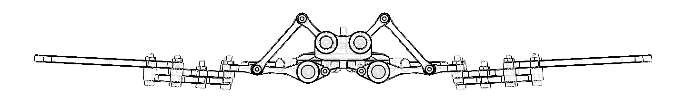

<h1 align="center">Hsiwu</h1>

  <strong>无MCU纯模拟电路仿生蝙蝠扑翼机器人</strong>
   
  三段独立驱动翅膀 · 纯模拟控制

  
  
  
  
  
   
  <a href="./README.md">English</a> | <a href="./README.zh-CN.md">中文版本</a>

---

## 名称由来

  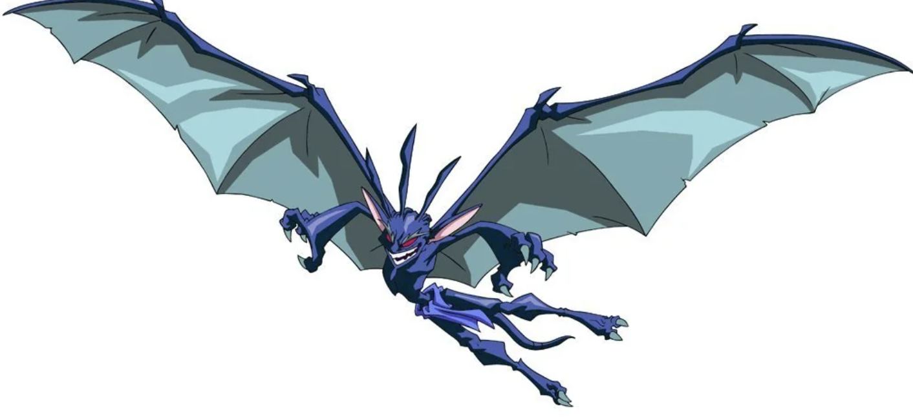
   
  <em><strong>Hsi Wu</strong>（西木），<strong>《成龙历险记》</strong>中的天之恶魔。</em>

本项目名称 **Hsiwu** 来源于《成龙历险记》中的蝙蝠形态**天之恶魔**——**Hsi Wu**（西木）。恰如其名：正如西木以分段变形之翼主宰天空，Hsiwu 机器人亦复现了真实蝙蝠的分段翼膜扑动。

---

## 项目简介

**Hsiwu**——以蝙蝠形态天之恶魔命名——是一款仿生蝙蝠扑翼机器人。与传统单段刚性机翼无人机不同，它复现了真实蝙蝠飞行中分段式翼膜变形的运动模式。每侧翅膀分为三个独立驱动的段落——**前缘段**、**中段**和**后缘段**——各自由独立的直流电机驱动。

仿生设计以*中华鼠耳蝠*（*Rhinolophus luctus*）为形态学参考。通过曲柄摇杆四连杆机构，将各直流电机的连续旋转运动转化为驱动翅膀段落的往复摆动，忠实再现了真实蝙蝠翼膜的耦合扑动-伸展运动学特性。

本项目的一个标志性特征是**纯模拟控制架构**。系统不使用任何微控制器（MCU），也不包含任何嵌入式软件。取而代之的是完全依赖分立模拟与数字逻辑电路——**NE555**定时器、**74HC04**反相器和**L293D** H桥驱动芯片——来产生驱动翅膀所需的同步周期性往复运动。

项目涵盖了完整的工程栈：模拟电子设计、数字逻辑、定制PCB布局、机械结构建模（SolidWorks）、FDM 3D打印以及硬件组装与调试。

> **参考文献**：气动与机械原理参考自《仿生蝙蝠飞行器的设计制造》（齐津浩，张卫平，2020），发表于《机械设计与研究》第36卷第5期。该参考样机翼展205 mm，整机质量17.81 g，扑动角度70°，扑动频率约10 Hz，在3.7 V供电下可产生约0.16 N的升力。

  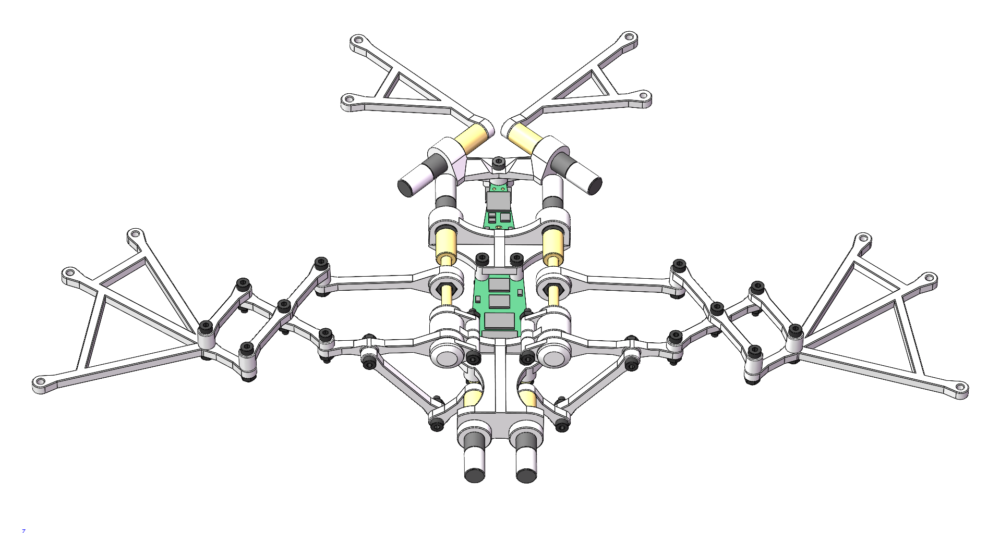
   
  <em><strong>图0 — 项目概览。</strong>Hsiwu 完整装配体的全彩三维渲染图。可见双侧对称框架底盘（中央支撑、头部支撑、尾部支架）、六段独立驱动翅膀（每侧三段——前缘、中段、后缘）、连杆、丝杠驱动剪式伸缩机构以及定制异形PCB。此渲染图对应于 <code>final_assembly.SLDASM</code> 中定义的最终装配状态。</em>

---

## 核心特性

- **仿生翅膀运动学** — 每侧翅膀三段独立驱动（前缘、中段、后缘），各段配备独立直流电机，模拟真实蝙蝠翼膜的伸展与弯曲。曲柄摇杆四连杆机构将电机连续旋转转化为往复扑动。
- **零MCU / 零代码** — 纯模拟控制：NE555多谐振荡器产生时序，74HC04六反相器进行相位分离，L293D双H桥实现双向电机驱动。无微控制器、无固件、无需编程。
- **定制异形PCB** — 在EasyEDA（LCEDA）和Altium Designer中设计的专用异形PCB，轮廓贴合内部机械框架。将电源管理、信号发生和电机驱动集成于单块紧凑电路板上。
- **模块化机械设计** — SolidWorks全参数化三维模型。框架部件可FDM 3D打印，采用标准M2/M3螺丝和铰链连杆组装，便于调校和维修。
- **集成电源管理** — 单节3.7V锂电池输入，MT3608升压转换器（3.7V → 7.35V供电机），板载LDO稳压（5V供逻辑电路），防反接保护，带指示灯电源开关。

---

## 系统架构

### 1. 电子系统（`/electronics`）

核心逻辑分布在集成于单块定制PCB上的五个功能模块中：

  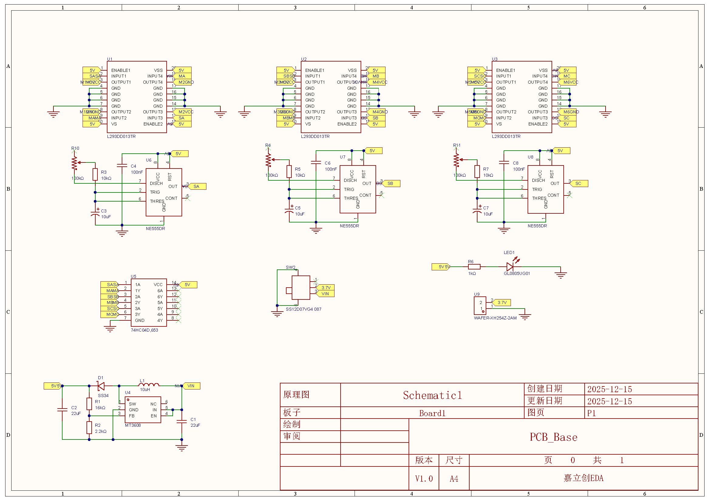
   
  <em><strong>图1 — 完整系统原理图。</strong>包含四个功能模块的完整电路图：（左）MT3608升压转换器，带肖特基二极管防反接保护和电源开关；（中上）三路NE555多谐振荡器级，各自产生独立的~4.8 Hz方波时序信号；（右）74HC04六反相器，用于产生互补相位信号；（下）三片L293D双H桥驱动芯片，每片使用一个半桥通道驱动一个电机，实现连续正反转往复运动。</em>

| 模块 | 核心器件 | 功能 |
|-------|-----------|----------|
| **电源供应** | MT3608、LDO、肖特基二极管 | 3.7V锂电 → 7.35V（升压，供电机）+ 5V（LDO，供逻辑）。防反接保护，带指示灯电源开关。 |
| **时序发生** | 3× NE555（多谐振荡模式） | 三路独立同步方波振荡器，频率约4.8 Hz。设定扑翼频率。每路NE555的RC网络可独立调校，实现分段时序微调。 |
| **相位反相** | 1× 74HC04 六反相器 | 将三路NE555输出反相，为H桥方向控制提供互补逻辑电平。每路NE555输出驱动一个反相器通道，产生对应半桥的反向信号。 |
| **电机驱动** | 3× L293D 双H桥 | 每片L293D使用一个半桥通道驱动一个电机。互补逻辑信号产生连续正反转往复运动。内置续流二极管防止感性反冲。 |
| **PCB布局** | 定制异形轮廓 | 垂直模块化布局；板外形贴合内部机械框架。异形板轮廓匹配中央支撑底盘的曲率。 |

  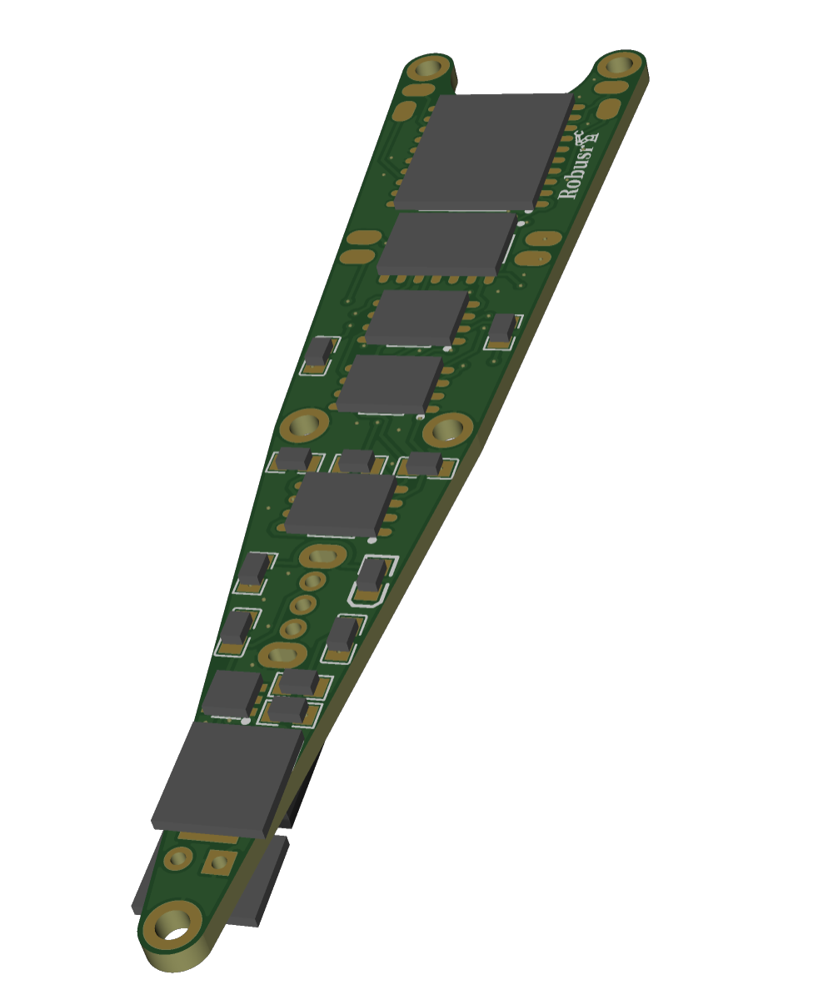
  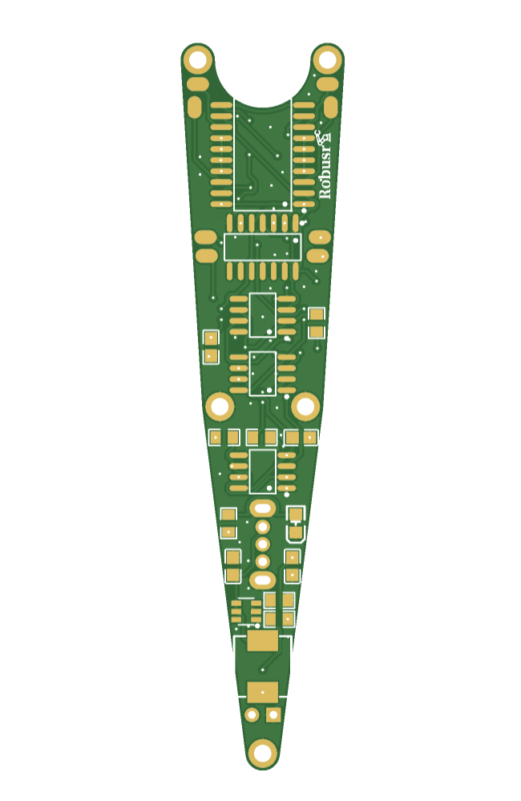
   
  <em><strong>图2a–2b — PCB设计视图（一）。</strong>左：三维渲染图，展示定制异形PCB上的元件布局——三片NE555（SOP-20封装，U1–U3）、74HC04（SOIC-14，U5）、三片L293D（SOIC-8封装等效，U6–U8）、MT3608（SOT-23-6，U4）、SMC肖特基二极管（D1）、SMD功率电感（L1）、XH-2A连接器（U9）、0805无源元件（R1–R11、C1–C8）以及滑动开关（SW2）。右：顶层铜皮布线及丝印覆盖层。</em>

  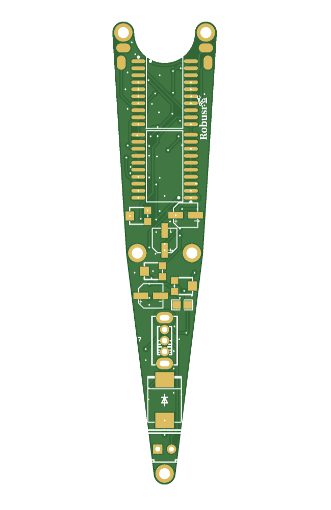
  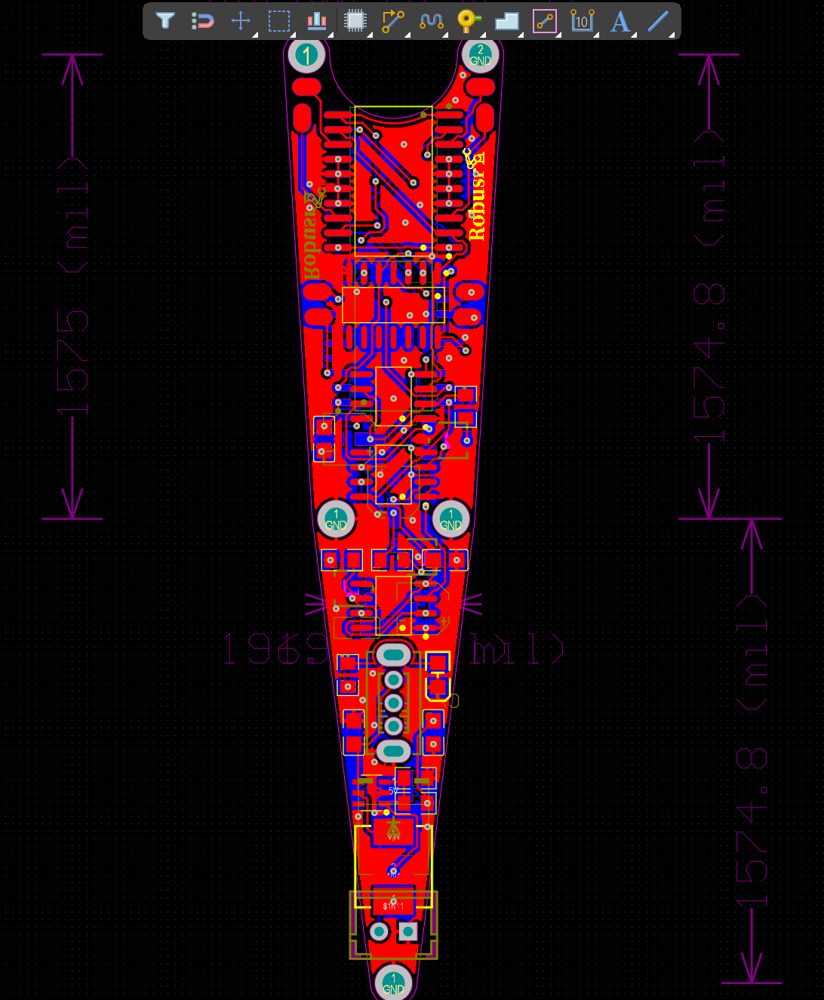
  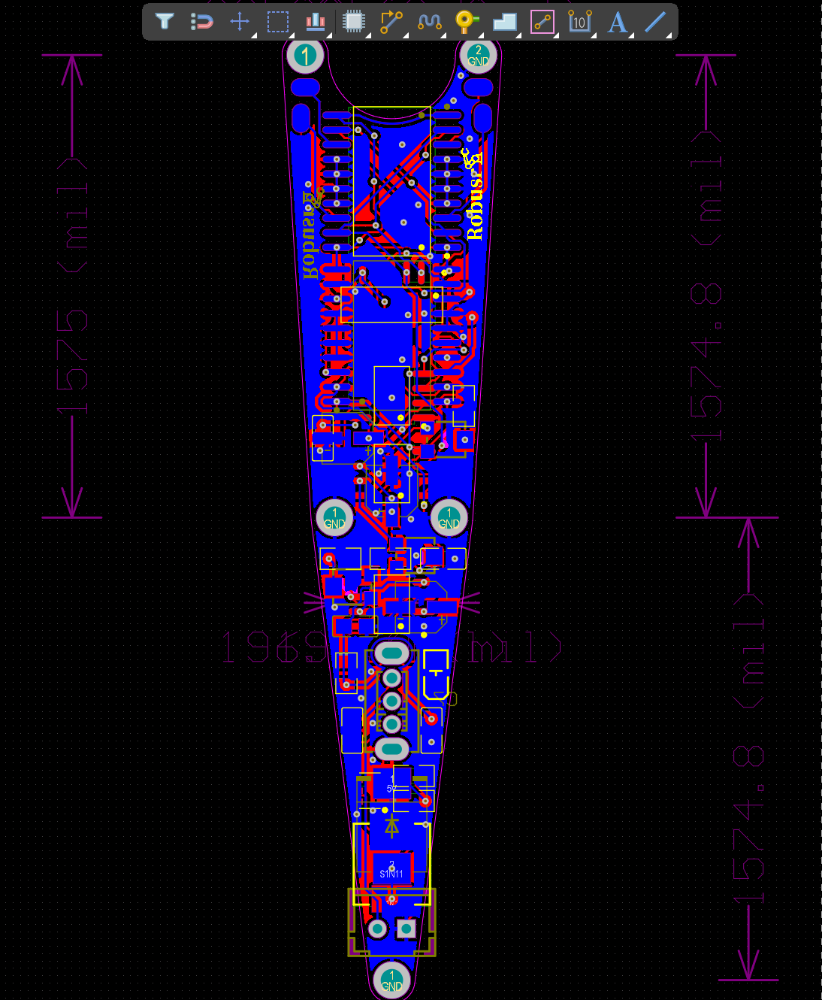
   
  <em><strong>图2c–2e — PCB设计视图（二）。</strong>从左至右：底层铜皮及丝印层；顶层裸铜走线（去填充）；底层裸铜走线（去填充）。Gerber制板文件位于 <code>electronics/output/gerber/</code>。</em>

### 2. 机械结构（`/mechanical`）

机械装配体在SolidWorks中设计（`.SLDPRT` / `.SLDASM`源文件），通过FDM 3D打印制造。运动学原理参考自《仿生蝙蝠飞行器的设计制造》（齐津浩、张卫平，2020）。

#### 2.1 运动学机构（参考文献）

以下运动学示意图引自参考文献，展示了构成翅膀传动系统的四个核心机构：

  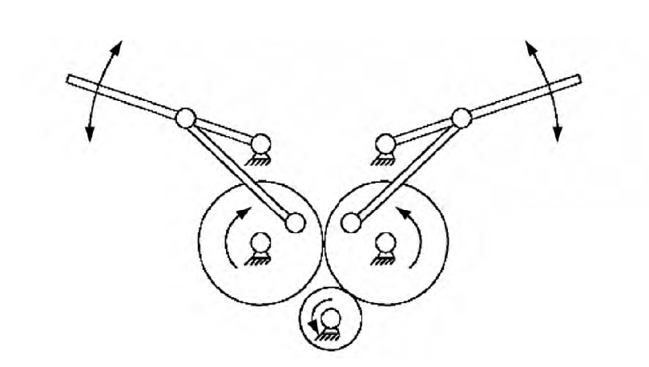
  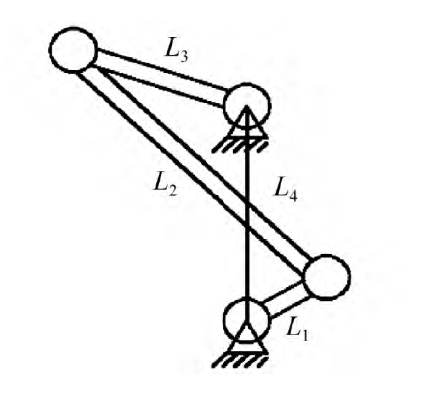
   
  <em><strong>图3a–3b — 曲柄摇杆四连杆机构。</strong>左：将电机轴连续旋转运动转化为摇杆上下往复摆动的曲柄摇杆机构运动学简图。曲柄（由减速空心杯直流电机驱动）连续旋转；连杆将运动传递给摇杆，摇杆输出角度决定了翅膀段落的扑动幅度（参考设计约70°）。右：带参数表的尺寸化连杆图纸——关键连杆长度a/b/c/d/e/f/g/h/i/j/k以及曲柄/摇杆枢轴角度α/β均按目标75°扑动行程标注。参考样机采用针对205 mm翼展优化的连杆比例。</em>

---

> 中文版本已合并至仓库首页 [`README.md`](README.md#中文版本)，在同一页面内即可切换中英文。
>
> The Chinese version has been merged into the repo home page [`README.md`](README.md#中文版本) — switch languages inline without navigating away.

  <a href="./README.md#中文版本">📖 查看中文版本（本页切换）</a>
  &nbsp;|&nbsp;
  <a href="./README.md#english">📖 View in English</a>

